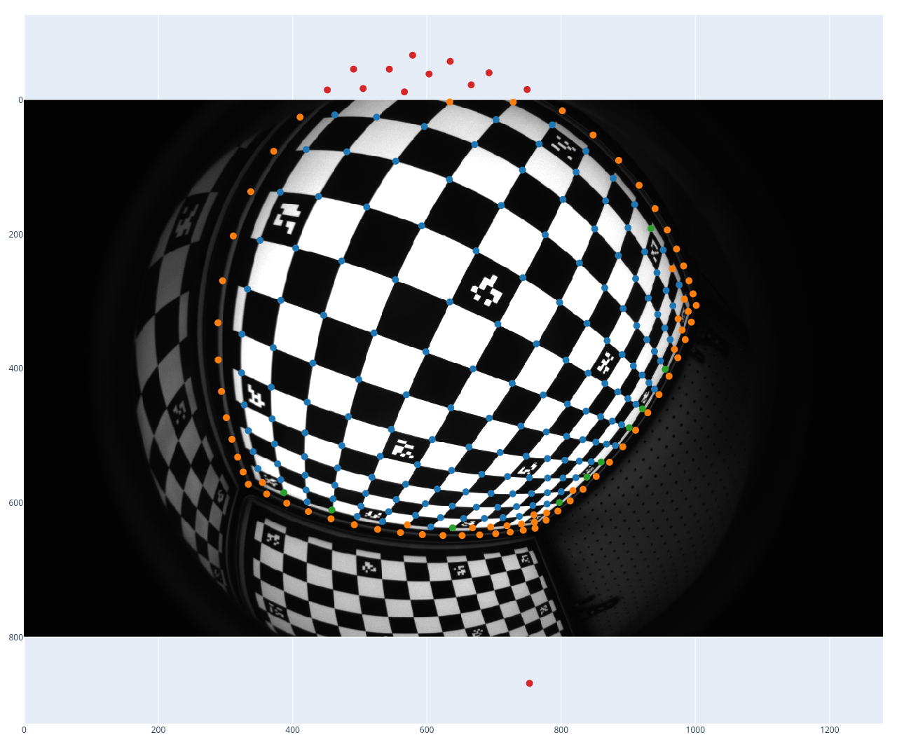
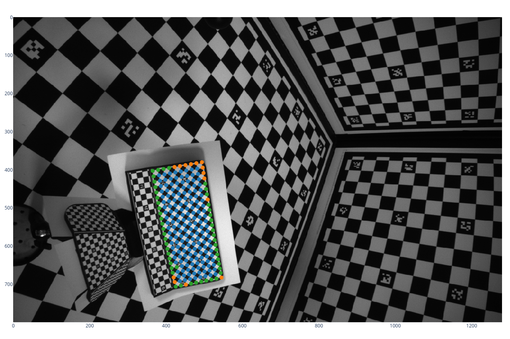

# Corner localization and camera calibration from imaged lattices

Recovered pruned points
 unchanged,
 filtered out,
 new corner,
 out of image.

This is the code for my master's thesis.
The code is a bit messy, so I recommend reading the [thesis](https://github.com/anstadnik/camera_calibration/blob/main/paper/paper.pdf) first.
To run the code, install [pixi](https://pixi.sh/latest/) and run `pixi shell`,
for example.

The code is structured as follows:
- **src**
  - **augmentations**: Augmentations for the dataset. Add an overlay image, or remove some corners.
  - **benchmark**: Find the error between the detected corners and the ground truth,
  for both real and synthetic data.
  - **data**: load the babelcalib dataset.
  - **feature_detector**: Detect corners in the image.
  - **feature_refiner**: Unused experimental code
  - **projector**: Camera model and projection functions.
  - **solver**
    - **optimization**: Optimization algorithms using Jax
    - **scaramuzza**: Scaramuzza's calibration algorithm, used for initialization
- **main.py**: Run the calibration algorithm on the dataset, entry point
- **notebooks**: Various visualizations, evaluation visualizations, and synthetic data generation. Also contains symbolic calculations, used in the thesis.
